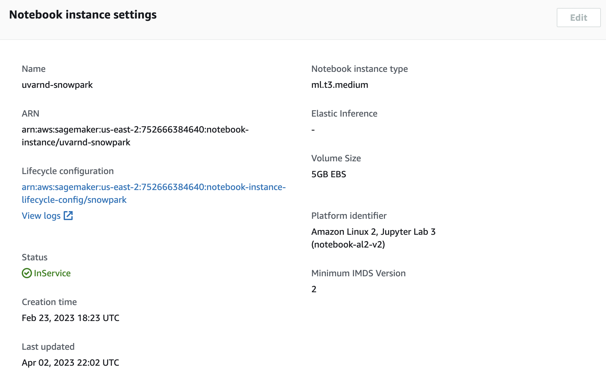
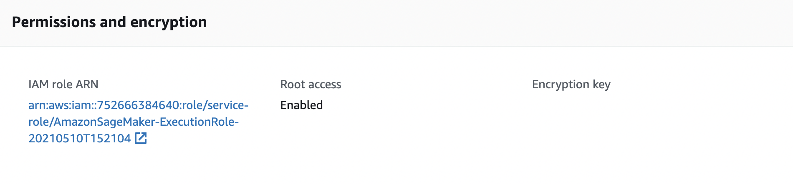
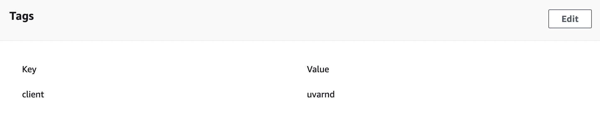

# Setting up the code on AWS SageMaker

## 1. Creating a SageMaker notebook

- Go to the [SageMaker dashboard](https://us-east-2.console.aws.amazon.com/sagemaker/home) to create a new notebook instance. For instance type, `ml.t3.medium` should be sufficient.

- Make sure to assign the right SageMaker execution role to this notebook. Request this from the AWS admin and include read & write permissions to:
    - AWS S3 (data storage)
    - SSM Parameter Store (storing keys/passwords similar to environment variables)

- Add the proper tags to the notebook instance. This is used for spend tracking purposes.

- **Start** the notebook once everything is set up.

- *ADVANCED:* Connect a GitHub repository to the notebook. Note that you will need to provide GitHub credentials to do this. Follow this [documentation](https://docs.aws.amazon.com/sagemaker/latest/dg/nbi-git-resource.html)

## 2. Running the notebook

- Copy the files from the `/Code/lib` and `/Code/notebooks` to the AWS notebook.
- Make sure to uncomment the lines of code that are indicated for AWS SageMaker use.
- For `data_extraction.ipynb`, use the `conda_mxnet_p38` kernel since Snowpark currently only works with Python 3.8

## 3. Closing the notebook

- Once you are done using the notebook, make sure to **Stop** the notebook to save costs.

## 4. Checking the resulting data

- Data for this project is stored in [AWS S3](https://s3.console.aws.amazon.com/s3/buckets/)
- Go to the `hum-rnd-data/UVA` folder to access this

## 5. Helpful Resources

- [Quickstart Guide for SageMaker x Snowflake parts 1 & 2](https://community.snowflake.com/s/article/Quickstart-Guide-for-Sagemaker-x-Snowflake-Part-1)