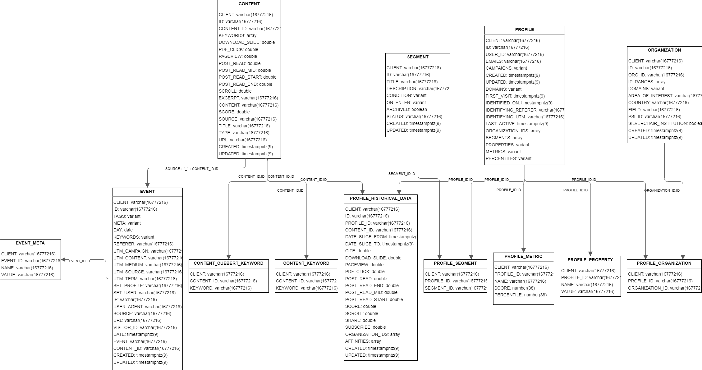

# Data

Data will be accesed through **Snowflake** and **Snowpark**

## Schema

Below is the schema provided by Hum:

Our project will mainly use the **Event** and **Profile** tables

## Data Description

### Event:

| Column       | Type           | Description                                                                   |
|--------------|----------------|-------------------------------------------------------------------------------|
| CLIENT       | VARCHAR        | ID for the client. For this project: "rup" for "Rockefeller University Press" |
| ID           | VARCHAR        | Unique ID for the event in each row                                           |
| TAGS         | VARIANT (JSON) | Tags or topics of the content                                                 |
| META         | VARIANT (JSON) | Meta data for each event                                                      |
| DAY          | DATE           | Date when the event occurred                                                  |
| KEYWORDS     | VARIANT (JSON) | Keywords used in the content                                                  |
| REFERER      | VARCHAR        | The source or link where the event came from                                  |
| UTM_CAMPAIGN | VARCHAR        | To be discussed with Hum                                                      |
| UTM_CONTENT  | VARCHAR        | To be discussed with Hum                                                      |
| UTM_MEDIUM   | VARCHAR        | To be discussed with Hum                                                      |
| UTM_SOURCE   | VARCHAR        | To be discussed with Hum                                                      |
| UTM_TERM     | VARCHAR        | To be discussed with Hum                                                      |
| SET_PROFILE  | VARCHAR        | ID connecting with Profile table                                              |
| SET_USER     | VARCHAR        | User email                                                                    |
| IP           | VARCHAR        | IP address of a user                                                          |
| USER_AGENT   | VARCHAR        | User agent of a user                                                          |
| SOURCE       | VARCHAR        | Source of the content. For this project: "rupress"                            |
| URL          | VARCHAR        | URL of the content                                                            |
| VISITOR_ID   | VARCHAR        | Unique ID per visitor. To be confirmed with Hum if this is per session        |
| DATE         | TIMESTAMP      | Timestamp of the event                                                        |
| EVENT        | VARCHAR        | Event type                                                                    |
| CONTENT_ID   | VARCHAR        | ID of the content                                                             |
| CREATED      | TIMESTAMP      | Timestamp of when the event was created                                       |
| UPDATED      | TIMESTAMP      | Timestamp of when the event was last updated                                  |

### Profile:

| Column              | Type           | Description                                                                   |
|---------------------|----------------|-------------------------------------------------------------------------------|
| CLIENT              | VARCHAR        | ID for the client. For this project: "rup" for "Rockefeller University Press" |
| ID                  | VARCHAR        | Unique ID for the row. Connects with Event set_profile                        |
| USER_ID             | VARCHAR        | Unique ID for each user                                                       |
| EMAILS              | VARCHAR        | Email addresses associated with a user                                        |
| CAMPAIGNS           | VARIANT (JSON) | Campaigns a user participated in                                              |
| CREATED             | TIMESTAMP      | Timestamp of when a user was created                                          |
| UPDATED             | TIMESTAMP      | Timestamp of when a user was last updated                                     |
| DOMAINS             | VARIANT (JSON) | Domains that a user has visited                                               |
| FIRST_VISIT         | TIMESTAMP      | Timestamp of when a user first visited the platform                           |
| IDENTIFIED_ON       | TIMESTAMP      | To be discussed with Hum                                                      |
| IDENTIFYING_REFERER | VARCHAR        | To be discussed with Hum                                                      |
| IDENTIFYING_UTM     | VARCHAR        | To be discussed with Hum                                                      |
| LAST_ACTIVE         | TIMESTAMP      | Timestamp of when a user was last active on the platform                      |
| ORGANIZATION_IDS    | ARRAY          | Organizations that a user is part of                                          |
| SEGMENTS            | ARRAY          | To be discussed with Hum                                                      |
| PROPERTIES          | VARIANT (JSON) | To be discussed with Hum                                                      |
| METRICS             | VARIANT (JSON) | To be discussed with Hum                                                      |
| PERCENTILES         | VARIANT (JSON) | To be discussed with Hum                                                      |
| USER_SIDS           | ARRAY          | To be discussed with Hum                                                      |