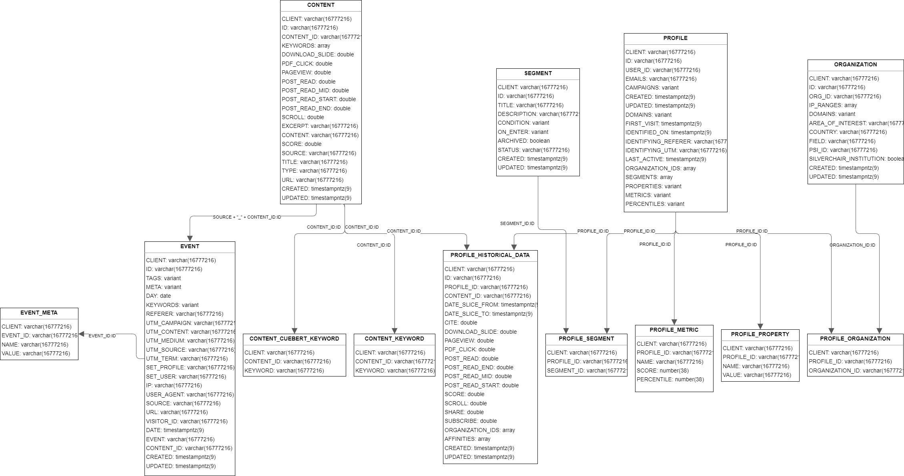

# Data

Data will be accesed through **Snowflake** and **Snowpark**

## Schema

Below is the schema provided by Hum:

Our project will mainly use the **Event**, **Profile**, and **Content** tables

## Data Description

### Event:

| Column       | Type           | Description                                                                   |
|--------------|----------------|-------------------------------------------------------------------------------|
| CLIENT       | VARCHAR        | ID for the client. For this project: "rup" for "Rockefeller University Press" |
| ID           | VARCHAR        | Unique ID for the event in each row                                           |
| TAGS         | VARIANT (JSON) | Tags or topics of the content                                                 |
| META         | VARIANT (JSON) | Meta data for each event                                                      |
| DAY          | DATE           | Date when the event occurred                                                  |
| KEYWORDS     | VARIANT (JSON) | Keywords used in the content                                                  |
| REFERER      | VARCHAR        | The source or link where the event came from                                  |
| UTM_CAMPAIGN | VARCHAR        | To be discussed with Hum                                                      |
| UTM_CONTENT  | VARCHAR        | To be discussed with Hum                                                      |
| UTM_MEDIUM   | VARCHAR        | To be discussed with Hum                                                      |
| UTM_SOURCE   | VARCHAR        | To be discussed with Hum                                                      |
| UTM_TERM     | VARCHAR        | To be discussed with Hum                                                      |
| SET_PROFILE  | VARCHAR        | ID connecting with Profile table                                              |
| SET_USER     | VARCHAR        | User email                                                                    |
| IP           | VARCHAR        | IP address of a user                                                          |
| USER_AGENT   | VARCHAR        | User agent of a user                                                          |
| SOURCE       | VARCHAR        | Source of the content. For this project: "rupress"                            |
| URL          | VARCHAR        | URL of the content                                                            |
| VISITOR_ID   | VARCHAR        | Unique ID per visitor. To be confirmed with Hum if this is per session        |
| DATE         | TIMESTAMP      | Timestamp of the event                                                        |
| EVENT        | VARCHAR        | Event type                                                                    |
| CONTENT_ID   | VARCHAR        | ID of the content                                                             |
| CREATED      | TIMESTAMP      | Timestamp of when the event was created                                       |
| UPDATED      | TIMESTAMP      | Timestamp of when the event was last updated                                  |

### Profile:

| Column              | Type           | Description                                                                   |
|---------------------|----------------|-------------------------------------------------------------------------------|
| CLIENT              | VARCHAR        | ID for the client. For this project: "rup" for "Rockefeller University Press" |
| ID                  | VARCHAR        | Unique ID for the row. Connects with Event set_profile                        |
| USER_ID             | VARCHAR        | Unique ID for each user                                                       |
| EMAILS              | VARCHAR        | Email addresses associated with a user                                        |
| CAMPAIGNS           | VARIANT (JSON) | Campaigns a user participated in                                              |
| CREATED             | TIMESTAMP      | Timestamp of when a user was created                                          |
| UPDATED             | TIMESTAMP      | Timestamp of when a user was last updated                                     |
| DOMAINS             | VARIANT (JSON) | Domains that a user has visited                                               |
| FIRST_VISIT         | TIMESTAMP      | Timestamp of when a user first visited the platform                           |
| IDENTIFIED_ON       | TIMESTAMP      | To be discussed with Hum                                                      |
| IDENTIFYING_REFERER | VARCHAR        | To be discussed with Hum                                                      |
| IDENTIFYING_UTM     | VARCHAR        | To be discussed with Hum                                                      |
| LAST_ACTIVE         | TIMESTAMP      | Timestamp of when a user was last active on the platform                      |
| ORGANIZATION_IDS    | ARRAY          | Organizations that a user is part of                                          |
| SEGMENTS            | ARRAY          | To be discussed with Hum                                                      |
| PROPERTIES          | VARIANT (JSON) | To be discussed with Hum                                                      |
| METRICS             | VARIANT (JSON) | To be discussed with Hum                                                      |
| PERCENTILES         | VARIANT (JSON) | To be discussed with Hum                                                      |
| USER_SIDS           | ARRAY          | To be discussed with Hum                                                      |

### Content:

| Column          | Type      | Description                                                                   |
|-----------------|-----------|-------------------------------------------------------------------------------|
| CLIENT          | VARCHAR   | ID for the client. For this project: "rup" for "Rockefeller University Press" |
| ID              | VARCHAR   | Unique ID for the row. Connects with Event set_profile                        |
| CONTENT_ID      | VARCHAR   | Unique ID for each content                                                    |
| KEYWORDS        | ARRAY     | Keywords associated with a content                                            |
| DOWNLOAD_SLIDE  | DOUBLE    | Number of times the content had a download slide event                        |
| PDF_CLICK       | DOUBLE    | Number of times the content had a PDF click event                             |
| PAGEVIEW        | DOUBLE    | Number of times the content had a page view event                             |
| POST_READ       | DOUBLE    | Number of times the content had a post read event                             |
| POST_READ_MID   | DOUBLE    | Number of times the content had a post read mid event                         |
| POST_READ_START | DOUBLE    | Number of times the content had a post read start event                       |
| POST_READ_END   | DOUBLE    | Number of times the content had a post read end event                         |
| SCROLL          | DOUBLE    | Number of times the content had a scroll event                                |
| EXCERPT         | VARCHAR   | Text excerpt from the content                                                 |
| CONTENT         | VARCHAR   | Description of the content                                                    |
| SCORE           | DOUBLE    | Sum of all the event columns                                                  |
| SOURCE          | VARCHAR   | Source of the content                                                         |
| TITLE           | VARCHAR   | Title of the content                                                          |
| TYPE            | VARCHAR   | Type of the content                                                           |
| URL             | VARCHAR   | URL of the content                                                            |
| CREATED         | TIMESTAMP | Timestamp of when a content was created                                       |
| UPDATED         | TIMESTAMP | Timestamp of when a content was updated                                       |

## Query Columns

- Final queries used can be found at `/Final/AWS/lib/snowpark_runner.py`

- Difference between classification & clustering queries:
    - Classification: comptues features using the first **X** events of a user
    - Clustering: computes features using **all** events of a user

- Queries from the start of 2022 to the current date

### Raw Query Columns
- `REACHED_X_EVENTS`: flag if a user reaches the event threshold
- `RECENT_LAST_EVENT`: flag if a user's latest event is within the last 21 days
- `EVENT_CYCLES`: number of periods in between *idle periods*
    - Idle time is roughly *72 hours* or *3 days*
    - Idle time computed using the average time between user events
    - Assuming the events behave as a Poisson random process, we modeled the time between events an exponential random variable. Then:
        - Approximate its parameter lambda to be the mean of the event gaps
        - The value corresponding to the 95% quantile of the CDF is used to determine the idle period length
- `DISTINCT_ARTICLES`: distinct number of articles that a user has interacted with
- `PERCENT_GOOGLE_ARTICLES`: percent of a user's articles interacted with that originated from a Google search
- `PERCENT_ARTICLE_CONTENT`: percent of a user's content interacted with that is an article
- `AVERAGE_CONTENT_SCORE`: average score of the content that a user interacted with
- `DAYS_TO_X_EVENTS`: days it took to get to X events
- `EVENTS`: total number of events
- `FIRST_EVENT_TIME`: timestamp of a user's first event
- `LATEST_EVENT_TIME`: timestamp of a user's latest event
- `DISTINCT_DAYS`: number of distinct days that a user is active on the platform
- `ARTICLES_PER_EVENT`: number of distinct articles divided by the number of events
- `EVENT_DENSITY`: number of events divided by the number of distinct days

### Final Model Features

Final features used in the model:

- `ARTICLES_PER_EVENT`
- `PERCENT_GOOGLE_ARTICLES`
- `PERCENT_ARTICLE_CONTENT`
- `EVENT_DENSITY`