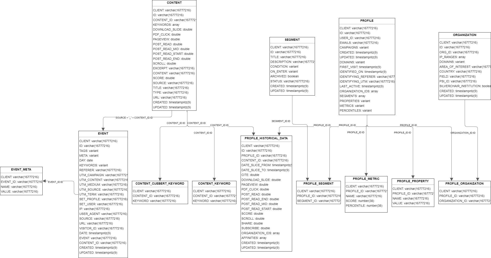

# Hum Engagement Time Machine
## Griffin McCauley, Eric Tria, Theo Thormann, Jake Weinberg
### UVA MSDS Capstone Project 2023

### Project Overview

Using first-party data collected from the customer data platform (CDP) Hum, we developed a model that can accurately classify the online readers of an academic publisher as being high- or low-quality based on their early-stage engagement profiles. Hum’s relational database contains over a dozen tables and almost 100 features in total. Using these tables, we engineered four new variables to serve as the basis of our analysis that illuminate differences between high-value and low-value user behavior. Through a combination of k-means clustering for determining training labels and a multilayer perceptron (MLP) for predicting which of our client’s users belong to each cluster, we were able to identify what characteristics are indicative of high- versus low-quality engagement. We also demonstrated our model’s ability to distinguish between these two profile types off of only a small volume of user data.

To ensure our analysis was interpretable and marketable for our sponsor, we purposefully limited our classification to two clusters. This enabled us to see striking patterns across the four features in question that strongly resembled the tendencies of a good user: a low number of articles read per event (signifies deeper engagement levels), a lower percentage of content that was reached through Google (as opposed to a more scholarly source such as PubMed or the publisher themselves), a lower percentage of content read that was an article (indicates engagement with figures and tables), and a high number of events performed per day engaging with the platform. Our MLP model leverages these four features derived from the users’ first 16 events (which is roughly equivalent to four total article reads due to the nature of how events are being tracked in the platform), and, based solely upon these features from the first 16 events, our MLP model is able to predict whether a user is high- or low-quality with 94% accuracy. While the innovative data cleaning and impressive model performance produced through this project are valuable on their own, these developments are additionally exciting as the engineered features and this model framework will now be able to serve as foundational components in the burgeoning field of digital academic publisher engagement.

## Primary Repository Contents

* Code
  * notebooks produced during the course of this project that document various iterations and previous versions of our model and codebase
  * (Note: Hum developers should also refer to the `/lib/` and `/notebooks/` folders located inside for our fully integrated final models)

* Data
  * a collection of .csv files used in the training and testing of some of our early-stage models

* Final
  * the code, data, and documentation for our final model

* Resources
  * documents chronicling our progress over the course of the year and supplemental administrative materials related to our team's composition and organization

## Data

Data will be accesed through **Snowflake** and **Snowpark**

### Schema

Below is the schema provided by Hum:

Our project will mainly use the **Event**, **Profile**, and **Content** tables

### Data Description

#### Event:

| Column       | Type           | Description                                                                   |
|--------------|----------------|-------------------------------------------------------------------------------|
| CLIENT       | VARCHAR        | ID for the client. For this project: "rup" for "Rockefeller University Press" |
| ID           | VARCHAR        | Unique ID for the event in each row                                           |
| TAGS         | VARIANT (JSON) | Tags or topics of the content                                                 |
| META         | VARIANT (JSON) | Meta data for each event                                                      |
| DAY          | DATE           | Date when the event occurred                                                  |
| KEYWORDS     | VARIANT (JSON) | Keywords used in the content                                                  |
| REFERER      | VARCHAR        | The source or link where the event came from                                  |
| UTM_CAMPAIGN | VARCHAR        | To be discussed with Hum                                                      |
| UTM_CONTENT  | VARCHAR        | To be discussed with Hum                                                      |
| UTM_MEDIUM   | VARCHAR        | To be discussed with Hum                                                      |
| UTM_SOURCE   | VARCHAR        | To be discussed with Hum                                                      |
| UTM_TERM     | VARCHAR        | To be discussed with Hum                                                      |
| SET_PROFILE  | VARCHAR        | ID connecting with Profile table                                              |
| SET_USER     | VARCHAR        | User email                                                                    |
| IP           | VARCHAR        | IP address of a user                                                          |
| USER_AGENT   | VARCHAR        | User agent of a user                                                          |
| SOURCE       | VARCHAR        | Source of the content. For this project: "rupress"                            |
| URL          | VARCHAR        | URL of the content                                                            |
| VISITOR_ID   | VARCHAR        | Unique ID per visitor. To be confirmed with Hum if this is per session        |
| DATE         | TIMESTAMP      | Timestamp of the event                                                        |
| EVENT        | VARCHAR        | Event type                                                                    |
| CONTENT_ID   | VARCHAR        | ID of the content                                                             |
| CREATED      | TIMESTAMP      | Timestamp of when the event was created                                       |
| UPDATED      | TIMESTAMP      | Timestamp of when the event was last updated                                  |

#### Profile:

| Column              | Type           | Description                                                                   |
|---------------------|----------------|-------------------------------------------------------------------------------|
| CLIENT              | VARCHAR        | ID for the client. For this project: "rup" for "Rockefeller University Press" |
| ID                  | VARCHAR        | Unique ID for the row. Connects with Event set_profile                        |
| USER_ID             | VARCHAR        | Unique ID for each user                                                       |
| EMAILS              | VARCHAR        | Email addresses associated with a user                                        |
| CAMPAIGNS           | VARIANT (JSON) | Campaigns a user participated in                                              |
| CREATED             | TIMESTAMP      | Timestamp of when a user was created                                          |
| UPDATED             | TIMESTAMP      | Timestamp of when a user was last updated                                     |
| DOMAINS             | VARIANT (JSON) | Domains that a user has visited                                               |
| FIRST_VISIT         | TIMESTAMP      | Timestamp of when a user first visited the platform                           |
| IDENTIFIED_ON       | TIMESTAMP      | To be discussed with Hum                                                      |
| IDENTIFYING_REFERER | VARCHAR        | To be discussed with Hum                                                      |
| IDENTIFYING_UTM     | VARCHAR        | To be discussed with Hum                                                      |
| LAST_ACTIVE         | TIMESTAMP      | Timestamp of when a user was last active on the platform                      |
| ORGANIZATION_IDS    | ARRAY          | Organizations that a user is part of                                          |
| SEGMENTS            | ARRAY          | To be discussed with Hum                                                      |
| PROPERTIES          | VARIANT (JSON) | To be discussed with Hum                                                      |
| METRICS             | VARIANT (JSON) | To be discussed with Hum                                                      |
| PERCENTILES         | VARIANT (JSON) | To be discussed with Hum                                                      |
| USER_SIDS           | ARRAY          | To be discussed with Hum                                                      |

#### Content:

| Column          | Type      | Description                                                                   |
|-----------------|-----------|-------------------------------------------------------------------------------|
| CLIENT          | VARCHAR   | ID for the client. For this project: "rup" for "Rockefeller University Press" |
| ID              | VARCHAR   | Unique ID for the row. Connects with Event set_profile                        |
| CONTENT_ID      | VARCHAR   | Unique ID for each content                                                    |
| KEYWORDS        | ARRAY     | Keywords associated with a content                                            |
| DOWNLOAD_SLIDE  | DOUBLE    | Number of times the content had a download slide event                        |
| PDF_CLICK       | DOUBLE    | Number of times the content had a PDF click event                             |
| PAGEVIEW        | DOUBLE    | Number of times the content had a page view event                             |
| POST_READ       | DOUBLE    | Number of times the content had a post read event                             |
| POST_READ_MID   | DOUBLE    | Number of times the content had a post read mid event                         |
| POST_READ_START | DOUBLE    | Number of times the content had a post read start event                       |
| POST_READ_END   | DOUBLE    | Number of times the content had a post read end event                         |
| SCROLL          | DOUBLE    | Number of times the content had a scroll event                                |
| EXCERPT         | VARCHAR   | Text excerpt from the content                                                 |
| CONTENT         | VARCHAR   | Description of the content                                                    |
| SCORE           | DOUBLE    | Sum of all the event columns                                                  |
| SOURCE          | VARCHAR   | Source of the content                                                         |
| TITLE           | VARCHAR   | Title of the content                                                          |
| TYPE            | VARCHAR   | Type of the content                                                           |
| URL             | VARCHAR   | URL of the content                                                            |
| CREATED         | TIMESTAMP | Timestamp of when a content was created                                       |
| UPDATED         | TIMESTAMP | Timestamp of when a content was updated                                       |

### Query Columns

- Final queries used can be found at `/Code/lib/snowpark_runner.py`

- Difference between classification & clustering queries:
    - Classification: comptues features using the first **X** events of a user
    - Clustering: computes features using **all** events of a user

- Queries from the start of 2022 to the current date

#### Raw Query Columns
- `REACHED_X_EVENTS`: flag if a user reaches the event threshold
- `RECENT_LAST_EVENT`: flag if a user's latest event is within the last 21 days
- `EVENT_CYCLES`: number of periods in between *idle periods*
    - Idle time is roughly *72 hours* or *3 days*
    - Idle time computed using the average time between user events
    - Assuming the events behave as a Poisson random process, we modeled the time between events an exponential random variable. Then:
        - Approximate its parameter lambda to be the mean of the event gaps
        - The value corresponding to the 95% quantile of the CDF is used to determine the idle period length
- `DISTINCT_ARTICLES`: distinct number of articles that a user has interacted with
- `PERCENT_GOOGLE_ARTICLES`: percent of a user's articles interacted with that originated from a Google search
- `PERCENT_ARTICLE_CONTENT`: percent of a user's content interacted with that is an article
- `AVERAGE_CONTENT_SCORE`: average score of the content that a user interacted with
- `DAYS_TO_X_EVENTS`: days it took to get to X events
- `EVENTS`: total number of events
- `FIRST_EVENT_TIME`: timestamp of a user's first event
- `LATEST_EVENT_TIME`: timestamp of a user's latest event
- `DISTINCT_DAYS`: number of distinct days that a user is active on the platform
- `ARTICLES_PER_EVENT`: number of distinct articles divided by the number of events
- `EVENT_DENSITY`: number of events divided by the number of distinct days

#### Final Model Features

Final features used in the model:

- `ARTICLES_PER_EVENT`
- `PERCENT_GOOGLE_ARTICLES`
- `PERCENT_ARTICLE_CONTENT`
- `EVENT_DENSITY`

## Models

Hum employees or individuals with access to Hum's Snowflake and AWS systems should refer to the code located in `/Code/lib/models.py` and `/Code/notebooks/` for our fully integrated and packaged Python models and Jupyter notebooks, respectively.

For everyone else, however, the methodology and results of our model can be reproduced locally using the files located in `/Final/`, and the following sections will outline how to sequentially perform the appropriate clustering and classification using static datasets which were previously extracted from Snowflake.

### Clustering

In order to determine the training labels for our data, we applied k-means clustering to the engineered features described above and derived from the users' entire event sequences. The entire process is laid out in the notebook `/Final/Clustering/Clustering.ipynb`, and the data required to execute this clustering can be downloaded and accessed from `/Final/Clustering/reached_16_all.csv`.

### Classification

Once the training labels were generated, we constructed an MLP model to perform user classification based on the engineered features described above but derived only from the users' first 16 events. The model building, training, and evaluation process is demonstrated in the notebook `/Final/Classification/Classification.ipynb`, and the data necessary to support training can be downloaded and reached from `/Final/Classification/training_labels.csv` and `/Final/Classification/reached_16_first_16.csv`.

## Results

The final results and performance metrics from our model are summarized in the plots below.

**Still need to add plots**

## Acknowledgment

We would like to acknowledge the contributions of the Hum staff, specifically Dr. Will Fortin, Niall Little, and Dylan DiGioia, to this project. We would also like to thank our capstone advisor, Dr. Judy Fox, for her assistance with this project.

## Full Repository Manifest

* Code/
  * eda/
    * eda.ipynb
    * eda.py
    * eda_features.ipynb
    * env-format.txt
  * lib/
    * aws_helper.py
    * file_helper.py
    * models.py
    * snowpark_conn.py
    * snowpark_runner.py
  * notebooks/
    * classification.ipynb
    * clustering.ipynb
    * data_extraction.ipynb
    * de_requirements.txt
  * resources/
    * aws_exeuction_role.png
    * aws_sagemaker_notebook.png
    * aws_tags.png
  * AWS_setup.md
  * ClusterAnalysis.ipynb
  * FinalModel.ipynb
  * HumMLP.ipynb
  * HumMLP_kNN.ipynb
  * IdleSequenceLengths.ipynb
  * RNN_sql_cleaning.ipynb
  * RNNdatacleaning.ipynb
  * profile_event.ipynb
  * stacked_hist.ipynb

* Data/
  * RNNdata.csv
  * data.md
  * hum_schema.png
  * new_features_40.csv
  * reached_16_all.csv
  * reached_16_first_16.csv
  * training_labels.csv

* Final/
  * Classification/
    * Classification.ipynb
    * reached_16_first_16.csv
    * training_labels.csv
  * Clustering/
    * Clustering.ipynb
    * reached_16_all.csv

* Resources/
  * RNN_Models/
    * Links/
      * .gitkeep
      * Linksheet.md
    * PDFs/
      * Predicting Customer Churn with Neural Networks in Keras _ by Kenny Hunt _ Towards Data Science.pdf
  * 02-13Update.pdf
  * 2022-02-19 New Model Proposal v2.pptx
  * 2023-01-29 DS6013 Project Proposal.pdf
  * Budget Proposal.pdf
  * Capstone Slides.pdf
  * CapstoneProjectBudget.pdf
  * DS6013 Capstone Project Proposal.pdf
  * EngagementTimeMachine_ProgressReport1.pdf
  * Final Project Report.pdf
  * Introduction - Hum-UVA_EngagementTimeMachine.pptx.pdf
  * Project Proposal.md
  * Retention Model Proposal v1.pdf
  * Talent Dashboard.pdf
  * Team Charter.pdf
  * Weekly Progress.md
  * eda.png
  * literature.txt
  * methods.png
  * model_2.png

* .gitignore
* README.md
