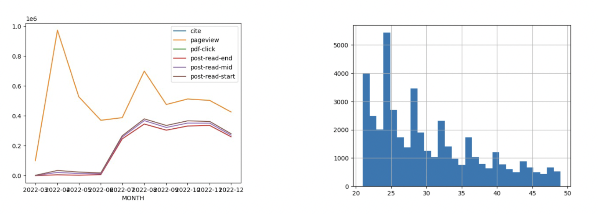
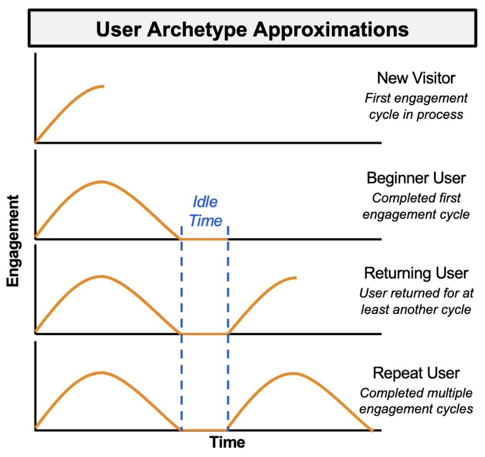

# Project Proposal: Engagement Time Machine

## Metadata
- Project: Engagement Time Machine
- Version Date: January 29, 2023
- Team Members: Griffin McCauley, Theo Thormann, Eric Tria, Jake Weinberg
- Advisor: Prof. Judy Fox

## Team Background / Roles
- **Griffin McCauley (Sc.B. Applied Mathematics & A.B. Economics)​**
    - Model Design and Data Analysis​
    - Liaison with the teaching staff
- **Theo Thormann (B.S. Environmental Science and Policy)**
    - Data Processing and Visualization
- **Eric Tria (B.S. Computer Science)**
    - Data Engineering and Analysis
- **Jake Weinberg (B.S. Commerce)**
    - Data Interpretation and Insights​
    - Communications

## Checklist of Goals
1. Understand trends in the data given to us by the client and figure out what data is useful in creating a model and what information is noise​
2. Create a user retention model, which finds patterns in user events to identify user churn risk and predict resubscription behavior​
3. Build an RNN to analyze the user event sequences on the platform​
4. Produce a 6-page publishable paper (in IEEE format), along with an oral presentation, on our work summarizing what the model the team has created and what we have found using our model​
5. Package and share our model, GitHub, and research findings with our client

## Client & Project Background

### Client: Hum
- Customer Data Platform (CDP)
- Use that data to help publishers understand their customers and content
- Focus on educational publishers

### Project
- Publishers want to maximize user retention
- To do this we will utilize user "events" to create models
- User events include pageviews, citations, scrolling activity, and more

### Completed Goals & Critical Activities
- Complete kickoff and onboarding
- Gain subject matter expertise
- Complete EDA
- Gain access to client data
- Understand necessary analysis tools

### Overall Goal
Create models using user events to maximize user retention and potentially other use cases for HUM

## Tasks and Timeline

### January 2023
- **Finish all set up and background research to prepare for model execution**
- Choose how to embed our data and input it to an RNN​
- Determine what criteria to use for isolating training data and classifying users​
- Coerce the data into the correct format and perform a trial run on a simple RNN model

### February 2023
- **Successfully complete initial training of user retention model**
- Build code that comprises the backbone of our model

### March 2023
- **Refine the model and perform hyperparameter tuning**
- Determine a subset of hyperparameters that we want to tune and select a reasonable range of values for these​
- Retrain and evaluate the model for a variety of hyperparameter configurations

### April 2023
- **Prepare final model for deployment and ensure customizability for clients**
- Extract insights from the model to market to clients​
- Package the model for easy interpretability and implementation by our client

## Weekly Workflow

### Monday
- **Class session from 9:00-11:00am EST​**
- Present weekly updates and next steps​
- Discuss current state of project with teaching staff

### Tuesday
- **Collaborative group session from 11:00am-12:30pm EST​**
- Continue to progress on weekly tasks while also discussing implementation techniques, new findings, and potential roadblocks

### Thursday
- **Sponsor meeting from 12:00-1:00pm EST​**
- Present the results of the past week’s tasks​
- Discuss the current trajectory of development and ask any pertinent questions related to the design or methodology incorporated in the model​
- Plot out goals for the coming week

## Datasets
- Use first-party customer data, which includes user events/actions collected by the client​
    - Example events are page views, page scrolls, and citations​
- The data is mostly cleaned for us by our client, our group will engineer the data to effectively prepare it for use in the model​
- Data is hosted on Snowflake ​
    - We will use Python integration through the Snowpark API​
- Machine Learning models will run on AWS SageMaker

Description of the data can be found [here](https://github.com/Data-ScienceHub/ETM/blob/main/Data/data.md)

### EDA
- Recurring events to use: citation, pageview, pdf-click, post-read-start, post-read-mid, post-read-end​
- Subset of users with 20-50 events in 2022 represents a significant portion of overall data

EDA notebooks can be found [here](https://github.com/Data-ScienceHub/ETM/tree/main/Code/eda)

## Mehods
- We currently plan on implementing an RNN for the user retention model​
    - Our sequence data will contain information regarding the event type and time of execution, and we will likely use an event-time joint embedding (Li et al., 2017) in order to incorporate both components into the model input​
- Details of the model architecture are still under consideration​
    - Potential use of an LSTM hidden layer for capturing longer-term sequence dependencies​
    - Probable use of a softmax activation layer for multiclass classification of the output​
- Depending on client needs, we may also add another RNN for sequence classification in addition to next-step event prediction

### Retention Model Path Forward

#### User Archetype Approximations

#### Propose Modeling Technique
- Leverage idle time interval as special event to denote period of disengagement​
    - Mark as idle if greater than 95% of users' event gaps​
    - Preliminary value of ~73 hours of idle time between event cycles per user (~280 hours as initial benchmark for churned out based on 90% quantile of users' maximum event gaps)​
- If an event sequence is not idle, predict the rest of the events until idle period is expected​
    - Then, use most recent completed sequence to predict whether the user will return​
- Sequence length of interest appears to be 16-48 events​
- Next steps would be to encode sequences of the desired lengths and to perform training for both sequence prediction and classification

## Conclusions & Future Work

## References
- Li, Y., Du, N., Bengio, S. (2017, July 31). Time-Dependent Representation for Neural Event Sequence     Prediction. Arxiv. Retrieved January 12, 2023, from  https://arxiv.org/abs/1708.00065​
- Savsunenko, O. (2020, January 4). How-to encode time property in recurrent neural networks. Towards    Data Science. Retrieved January 12, 2023, from https://towardsdatascience.com/how-to-encode-  time-property-in-recurrent-neutral-networks-friday-experiment-c14c39ba9755